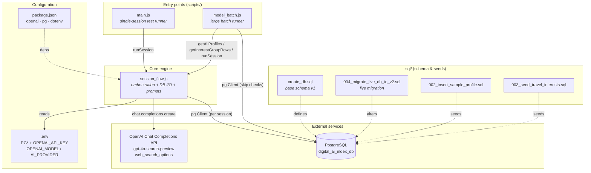
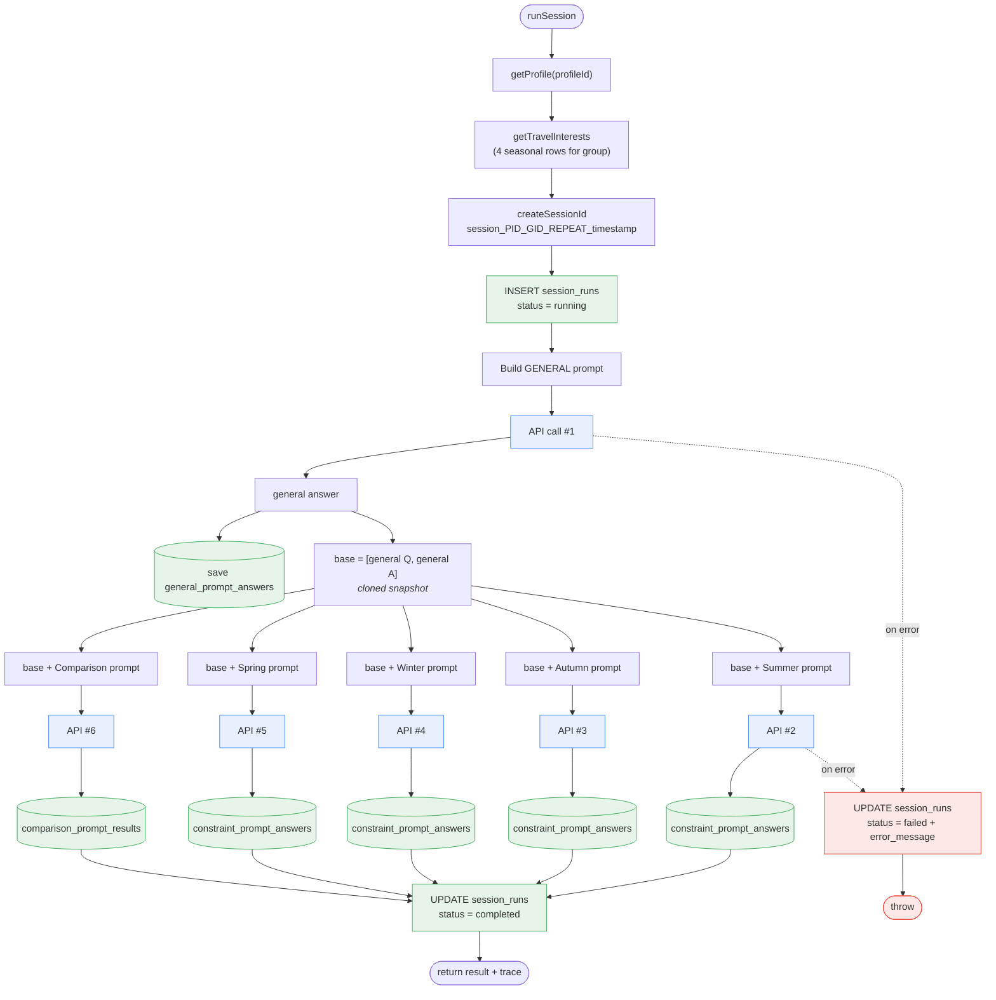
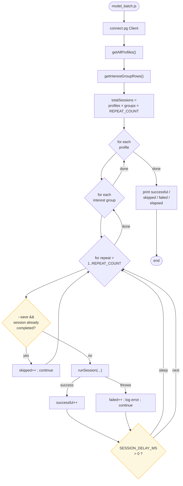
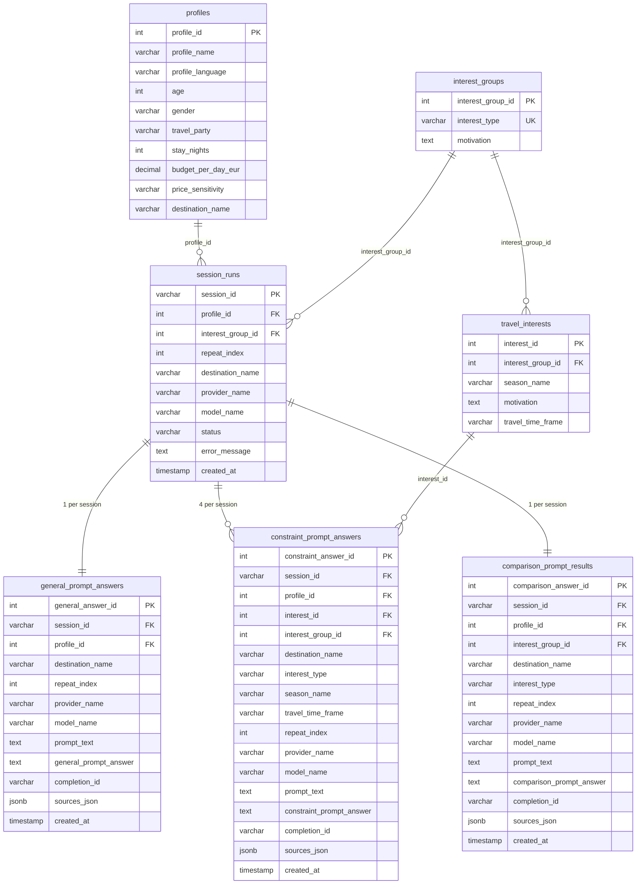

# Digitális AI Index — Architecture

Research data-collection pipeline that queries AI models about lakeside tourism
recommendations across profiles, thematic groups, seasons, and providers, then
stores the structured outputs in PostgreSQL for downstream analysis.

All diagrams below are [Mermaid.js](https://mermaid.js.org/) and render directly
on GitHub / most Markdown viewers.

---

## 1. Module & dependency layout

How the three scripts, the SQL layer, and external services fit together.

---

## 2. Session logic — the 6-prompt branched thread

One session = 1 profile × 1 thematic group × 1 repeat × 1 model. The general
answer establishes a baseline; each follow-up forks from that baseline so seasons
never see each other (anti carry-over). Total = 6 API calls regardless of branching.

> Note: the 5 follow-ups each fork from `base` (general Q+A only). Seasonal
> answers are **not** visible to each other or to the comparison prompt.

---

## 3. Batch runner — combinatorial loop with skip/resume

`model_batch.js` iterates profile × group × repeat for one model/provider
(set via env). Destination comes from the profile row; the model from `.env`.

Skip key (`sessionAlreadyExists`): `profile_id + interest_group_id +
repeat_index + provider_name + model_name` where `status = 'completed'`.
Failed sessions are **not** skipped → they retry on rerun.

---

## 4. Database schema (ER diagram)

7 tables. `session_runs` is the audit header; the three answer tables are
intentionally denormalized for Excel export.

---

## 5. End-to-end research pipeline (collection → analysis)

Where the code stops (data collection) and where the methodology's later
phases begin (extraction, scoring, benchmarking — not yet implemented).

```mermaid
flowchart LR
    subgraph DIM["Research dimensions"]
        P["P profiles"]
        D["D destinations"]
        G["G groups"]
        M["M models"]
        R["R repeats"]
    end

    DIM --> GEN["Combinatorial<br/>session generation<br/>P×D×G×M×R"]
    GEN --> COLLECT["session_flow.js<br/>6 prompts / session"]
    COLLECT --> STORE[("PostgreSQL<br/>7 rows / session")]

    STORE --> EXPORT["Excel / CSV export"]
    STORE -.future.-> NER["Entity extraction<br/>(NER) + normalization"]
    NER -.future.-> RANK["Rank + co-occurrence<br/>structuring"]
    RANK -.future.-> SCORE["AI Visibility Score<br/>5 dimensions"]
    SCORE -.future.-> BENCH["Benchmarking vs.<br/>competitor destinations"]

    classDef impl fill:#e6f4ea,stroke:#34a853;
    classDef future fill:#f1f3f4,stroke:#9aa0a6,stroke-dasharray:4 3;
    class GEN,COLLECT,STORE,EXPORT impl;
    class NER,RANK,SCORE,BENCH future;
```

Solid = implemented in this repo. Dashed = later research phases described in
the methodology but not yet in code.
