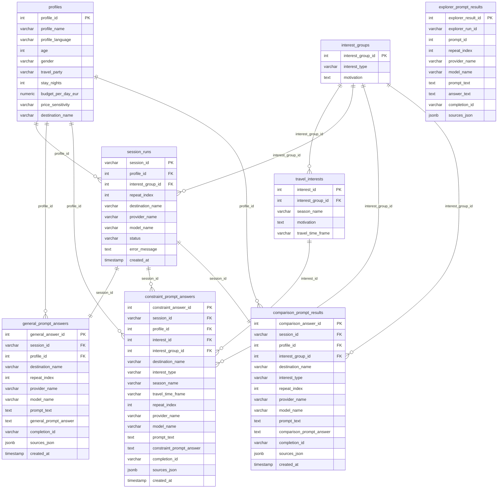

# Digitalis_AI_Index

This repository contains the prompt-based data collection pipeline for the AI visibility / destination discoverability study.

The current checked-in core runner is configured for **OpenAI / `gpt-5.5`**, but the experimental logic is intentionally broader than one provider. The same pull structure can later be used for **Claude**, **Gemini**, or another comparable model runner, as long as the same prompt design is preserved.

## Project Purpose

The project is designed to measure how AI systems surface and frame destinations under controlled tourism scenarios.

The practical research questions are:

- which destinations get surfaced
- which sources and links get surfaced
- how the same destination is framed for different traveler profiles
- how the same destination performs across thematic product groups
- how recommendations shift across seasonal framing
- which competitor lakeside destinations appear in comparison prompts

In the current baseline setup, the focal destination is typically **Lake Balaton**, but the design itself is destination-agnostic. The destination name is injected through the profile data, so the same session logic can later be reused for another destination without rewriting the prompt engine.

## What This Project Does

The main experiment measures how an AI system presents a destination under controlled profile, thematic, and seasonal conditions.

The current design is built around:

- `12` traveler profiles
- `7` thematic interest groups
- `5` heuristic repetitions
- `1` destination per run
- `1` model per run

Each experimental unit is a **session**.

One session means:

- `1` profile
- `1` interest group
- `1` repeat index
- `1` model

So the experiment is not “one big chat”. It is a structured grid of repeated, comparable sessions.

## Explorer Prompts

Besides the main profile-based experiment, the repository also contains an **explorer prompt** workflow.

The explorer prompts serve a different purpose from the main session logic:

- the main experiment asks: how is a specific destination recommended under controlled profile and thematic conditions?
- the explorer prompts ask: what destinations appear when the model is asked broader, more discovery-oriented tourism questions?

So the explorer layer is meant to capture **general AI destination discovery behavior**, not profile-conditioned session behavior.

### How the explorer prompts differ from the main run

The explorer prompts are:

- broader
- not tied to a traveler profile
- not tied to the thematic interest groups
- not tied to the 4 seasonal follow-up branches
- asked as separate standalone prompts

This means the explorer workflow is **not** a 6-prompt session design.

Instead:

- `1 explorer prompt = 1 API request = 1 result row`

Each explorer prompt is intentionally run in isolation so that one discovery question does not contaminate the next one.

### Current explorer prompt count

The background document refers to `9` explorer prompts, but in the current codebase only `8` concrete prompt texts were recoverable and implemented in the runner.

So the current operational explorer design is:

- `8` explorer prompts

### Explorer repetition logic

Unlike the main session workflow, the explorer prompts do not form one shared conversation thread.

Instead:

- each explorer prompt is executed independently
- each prompt can be repeated heuristically multiple times

If:

- `E = number of explorer prompts`
- `R = number of heuristic repeats`
- `M = number of models`

then:

- `explorer requests per model = E × R`

With the current implemented explorer setup:

- `E = 8`
- `R = 5`

So:

- `8 × 5 = 40 explorer requests per model`

If the same explorer set is later run on `3` models, then:

- `40 × 3 = 120 explorer records`

### What the explorer prompts measure

They are useful for questions such as:

- does Lake Balaton appear at all in broad AI destination discovery?
- if it appears, how prominently does it appear?
- what other lakeside destinations appear alongside it?
- which sources and domains are used in those broader discovery answers?

So the explorer prompts complement the main experiment:

- the main experiment measures controlled profile-based destination visibility
- the explorer prompts measure broader AI discovery visibility

### Explorer output structure

The explorer results are stored separately from the main session tables.

The current explorer storage unit is:

- `1 prompt × 1 repeat = 1 row in explorer_prompt_results`

The main saved fields are:

- `explorer_run_id`
- `prompt_id`
- `repeat_index`
- `provider_name`
- `model_name`
- `prompt_text`
- `answer_text`
- `completion_id`
- `sources_json`

So for the current implemented explorer pull:

- `8 prompts`
- `5 repeats`
- `1 model`

the expected stored result size is:

- `40 explorer rows`

## Session Structure

One session always contains **6 prompts**:

1. `1` general prompt
2. `4` seasonal constraint prompts
3. `1` comparison prompt

In other words:

- `1` general prompt introduces the profile and destination
- `4` follow-up prompts ask the same thematic question across the four seasonal variants
- `1` comparison prompt asks for competing European lakeside destinations

This means:

- `1 session = 6 prompts`

## What One Session Really Represents

One session is one controlled observation of the following combination:

- one traveler profile
- one thematic product group
- one heuristic repeat
- one destination context
- one model

That means the session is the main observational unit of the study.

Inside that one unit:

- the general prompt establishes the traveler and destination context
- the seasonal prompts test the same thematic goal under four seasonal frames, with optional season-specific wording
- the comparison prompt tests which competing destinations the model surfaces for the same profile context

So the pipeline is not just generating text. It is generating a structured set of comparable observations.

## Why The 4 Seasonal Prompts Matter

Each interest group is linked to **4** rows in `travel_interests`:

- `Summer`
- `Autumn`
- `Winter`
- `Spring`

So the follow-up part is not arbitrary. The code is explicitly designed to run all four seasonal variants for the same thematic group.

## Core Math

### Base variables

These are the main dimensions of the experiment:

- `P = number of profiles`
- `G = number of interest groups`
- `R = number of heuristic repeats`
- `S = number of seasonal follow-up prompts per group`
- `M = number of models`
- `D = number of destinations`

In the current main design:

- `P = 12`
- `G = 7`
- `R = 5`
- `S = 4`

And for the current prompt structure:

- `prompts per session = 1 general + S follow-ups + 1 comparison`
- therefore: `prompts per session = 1 + 4 + 1 = 6`

### Main formulas

Sessions per destination per model:

- `sessions = P × G × R`

Prompts per destination per model:

- `prompts = P × G × R × (1 + S + 1)`

For the current structure this becomes:

- `prompts = P × G × R × 6`

### One destination, one model

The current main design is:

- `12 profiles`
- `8 interest groups`
- `5 repeats`

So:

- `12 × 8 × 5 = 480 sessions`

And because:

- `1 session = 6 prompts`

the full prompt count for **one destination, one model** is:

- `480 × 6 = 2880 prompts`

### One destination, three models

If the same destination is pulled with three model families, then:

- `2880 × 3 = 8640 prompts`

### Eight destinations, three models

If the same design is repeated for eight destinations:

- `8640 × 8 = 69,120 prompts`

### Storage formulas

For every completed session, the DB gets:

- `1` row in `session_runs`
- `1` row in `general_prompt_answers`
- `4` rows in `constraint_prompt_answers`
- `1` row in `comparison_prompt_results`

So:

- `rows per completed session = 7`

For one destination / one model:

- `480 completed sessions × 7 rows = 3360 total DB rows`

Broken down:

- `480` session header rows
- `480` general answer rows
- `1920` constraint answer rows
- `480` comparison answer rows

## How Repetition Works

The heuristic repetition is implemented at the **session level**, not as a separate “repeat each prompt independently” engine.

That means the system repeats the whole unit:

- same profile
- same interest group
- same model
- new `repeat_index`

This is still analytically useful, because every saved answer row contains `repeat_index`, so prompt-level repeated observations can be reconstructed later.

The precise methodological statement is:

- the code performs **session-level heuristic repetition**
- which produces **prompt-level repeated observations**

## Why This Matters

This structure keeps the experiment internally consistent:

- the same profile logic is reused
- the same thematic groups are reused
- the same 4 seasonal variants are reused
- the same comparison logic is reused

That is what makes outputs comparable across profiles, groups, seasons, and later across models.

## Conversation Logic Inside A Session

The session is **branched**, not fully cumulative.

The flow is:

1. build and send the general prompt
2. receive the general answer
3. use that answer as the shared base context
4. create separate branches for the `4` seasonal follow-ups
5. create a separate branch for the comparison prompt

Important consequence:

- the `4` seasonal answers do **not** see each other
- the comparison prompt does **not** inherit the seasonal answers
- all branches inherit only the general prompt + general answer base

This is deliberate. It reduces cross-prompt contamination inside the same session.

## Prompt Types

### General prompt

Built from the profile row:

- age
- gender
- travel party
- stay length
- budget
- destination

### Constraint prompts

Built from:

- group-level thematic motivation, with optional seasonal override
- seasonal travel time frame

### Comparison prompt

Built from:

- destination
- same profile context
- same thematic motivation

## Current General Prompt Template

The current general prompt template in the code is:

```text
I am a [age]-year-old [gender]. I would like to travel to [destination] for [nights] nights [travel_party]. Could you recommend some activities and programmes in the area [for me/for us] within a budget of max [budget] EUR per person per day?
```

The `for me / for us` switch is controlled by the travel-party wording:

- solo traveler (`on my own`) -> `for me`
- all non-solo cases -> `for us`

## Current 12 Profile Prompts

With the current profile table, the instantiated general prompts are:

1. `I am a 25-year-old man. I would like to travel to Lake Balaton for 3 nights on my own. Could you recommend some activities and programmes in the area for me within a budget of max 100 EUR per person per day?`
2. `I am a 30-year-old woman. I would like to travel to Lake Balaton for 3 nights with my partner. Could you recommend some activities and programmes in the area for us within a budget of max 200 EUR per person per day?`
3. `I am a 34-year-old man. I would like to travel to Lake Balaton for 7 nights with my partner and our young child. Could you recommend some activities and programmes in the area for us within a budget of max 50 EUR per person per day?`
4. `I am a 42-year-old man. I would like to travel to Lake Balaton for 7 nights with my partner and our children. Could you recommend some activities and programmes in the area for us within a budget of max 100 EUR per person per day?`
5. `I am a 38-year-old woman. I would like to travel to Lake Balaton for 5 nights with my child, as a single parent. Could you recommend some activities and programmes in the area for us within a budget of max 50 EUR per person per day?`
6. `I am a 25-year-old man. I would like to travel to Lake Balaton for 3 nights with a group of friends. Could you recommend some activities and programmes in the area for us within a budget of max 100 EUR per person per day?`
7. `I am a 48-year-old woman. I would like to travel to Lake Balaton for 5 nights with my partner. Could you recommend some activities and programmes in the area for us within a budget of max 200 EUR per person per day?`
8. `I am a 56-year-old man. I would like to travel to Lake Balaton for 7 nights with my partner. Could you recommend some activities and programmes in the area for us within a budget of max 200 EUR per person per day?`
9. `I am a 67-year-old woman. I would like to travel to Lake Balaton for 7 nights with my partner. Could you recommend some activities and programmes in the area for us within a budget of max 100 EUR per person per day?`
10. `I am a 72-year-old woman. I would like to travel to Lake Balaton for 4 nights on my own. Could you recommend some activities and programmes in the area for me within a budget of max 100 EUR per person per day?`
11. `I am a 45-year-old woman. I would like to travel to Lake Balaton for 7 nights as a three-generation family, together with grandparents, parents and children. Could you recommend some activities and programmes in the area for us within a budget of max 100 EUR per person per day?`
12. `I am a 62-year-old man. I would like to travel to Lake Balaton for 5 nights with a group of friends. Could you recommend some activities and programmes in the area for us within a budget of max 100 EUR per person per day?`

## Thread Logic And Context Insertion

The session logic is easiest to understand if you think of it as a **message array** that gets built up and then branched.

### Important point

The code does **not** add a custom system prompt of its own to the conversation history.

What the code explicitly sends into the OpenAI request is:

- the current message history
- the fixed model name
- the required web search tool
- the configured search context size

So the session-level context inserted by this repository comes from the message thread itself, not from a custom hidden system instruction written by us.

### Step-by-step thread construction

For one session, the thread evolves like this:

1. start with an empty `messages` array
2. append the general user prompt
3. send that to the API
4. append the assistant general answer
5. clone that base context
6. for each seasonal follow-up, create a separate branch from the same base
7. for the comparison prompt, create another separate branch from the same base

This means:

- the seasonal follow-ups do not see each other
- the comparison prompt does not see the seasonal follow-up answers
- every branch sees only the shared general base

### The actual context formula

General prompt call:

- `[general user prompt]`

Each seasonal branch call:

- `[general user prompt, general assistant answer, one seasonal user prompt]`

Comparison branch call:

- `[general user prompt, general assistant answer, one comparison user prompt]`

So there is no cumulative chain like:

- general -> summer -> autumn -> winter -> spring -> comparison

Instead it is:

- general base
- then multiple branches from that same base

### Why this matters

This is methodologically important because it reduces carry-over contamination.

If the seasonal prompts were run as one accumulating chat, then:

- the summer answer could influence autumn
- autumn could influence winter
- winter could influence spring
- all of them could influence comparison

The current design prevents that. Each branch is isolated except for the shared general base.

## Example Walkthrough

Take this session:

- profile: `1`
- destination: `Lake Balaton`
- interest group: `Wellness`
- repeat: `1`

### Step 1: general prompt

The first message array is:

```text
User:
I am a 25-year-old man. I would like to travel to Lake Balaton for 3 nights on my own. Could you recommend some activities and programmes in the area for me within a budget of max 100 EUR per person per day?
```

The API returns:

- one general answer
- one completion id
- one source list

Then the code appends that assistant answer to the base thread.

### Step 2: summer seasonal branch

If the `Wellness` summer row says:

- motivation: `relax, unwind and recharge through wellness and spa experiences`
- time frame: `between June and August`

then the summer branch is built from:

```text
User: general prompt
Assistant: general answer
User: On this trip I am travelling mainly to relax, unwind and recharge through wellness and spa experiences. Could you recommend 5 places in the area between June and August?
```

That branch is sent to the API on its own.

### Step 3: autumn / winter / spring branches

The same logic is repeated independently for:

- Autumn
- Winter
- Spring

Each one starts again from:

- general user prompt
- general assistant answer

and then appends only its own seasonal user prompt.

### Step 4: comparison branch

The comparison branch also starts from the same base:

```text
User: general prompt
Assistant: general answer
User: Besides Lake Balaton, could you recommend five other lakeside destinations in Europe where I could best relax, unwind and recharge through wellness and spa experiences, and which also fit my profile and budget?
```

Again:

- it does not see the 4 seasonal answers
- it only sees the general base plus its own comparison question

### What gets saved from that one session

For that one session, the DB will contain:

- `1` session header row
- `1` general answer row
- `4` seasonal constraint rows
- `1` comparison row

So:

- `1 session -> 7 saved DB rows`
- `1 session -> 6 API calls`

## What The API Actually Sees

Below is the practical shape of the `messages` payload that the API sees at each stage.

### General call

```js
[
  {
    role: "user",
    content: "I am a 25-year-old man. I would like to travel to Lake Balaton for 3 nights on my own. Could you recommend some activities and programmes in the area for me within a budget of max 100 EUR per person per day?"
  }
]
```

So the first call sees only:

- one user message
- no earlier assistant answer
- no seasonal context
- no comparison context

### One seasonal branch call

```js
[
  {
    role: "user",
    content: "I am a 25-year-old man. I would like to travel to Lake Balaton for 3 nights on my own. Could you recommend some activities and programmes in the area for me within a budget of max 100 EUR per person per day?"
  },
  {
    role: "assistant",
    content: "[general answer text returned by the model]"
  },
  {
    role: "user",
    content: "On this trip I am travelling mainly to relax, unwind and recharge through wellness and spa experiences. Could you recommend 5 places in the area between June and August?"
  }
]
```

So a seasonal branch sees:

- the original general prompt
- the model's general answer
- one new seasonal follow-up question

It does **not** see:

- the other seasonal prompts
- the other seasonal answers
- the comparison prompt

### Comparison branch call

```js
[
  {
    role: "user",
    content: "I am a 25-year-old man. I would like to travel to Lake Balaton for 3 nights on my own. Could you recommend some activities and programmes in the area for me within a budget of max 100 EUR per person per day?"
  },
  {
    role: "assistant",
    content: "[general answer text returned by the model]"
  },
  {
    role: "user",
    content: "Besides Lake Balaton, could you recommend five other lakeside destinations in Europe where I could best relax, unwind and recharge through wellness and spa experiences, and which also fit my profile and budget?"
  }
]
```

So the comparison branch sees:

- the original general prompt
- the model's general answer
- one new comparison question

It does **not** see:

- the 4 seasonal follow-up answers
- any accumulated seasonal branch history

### Fixed request configuration sent together with the messages

Every call also includes the same non-message settings:

```js
{
  model: "gpt-5.5",
  tools: [
    {
      type: "web_search",
      search_context_size: "medium"
    }
  ],
  tool_choice: "required",
  include: ["web_search_call.action.sources"]
}
```

So the total effective API input is:

- the current branch-specific `messages`
- fixed model choice
- required web search
- fixed or overridden search context size
- explicit source capture

## API Layer: What Is Sent And What Is Returned

The current OpenAI runner uses the **Responses API** with required web search.

Conceptually, one API call sends:

- the model name
- the current message history
- the web search tool configuration
- the search context size

In the current implementation, a typical call looks like this conceptually:

```js
openai.responses.create({
  model: "gpt-5.5",
  input: messages,
  tools: [
    {
      type: "web_search",
      search_context_size: "medium"
    }
  ],
  tool_choice: "required",
  include: ["web_search_call.action.sources"]
})
```

### What one API call gives back

From each response object, the pipeline extracts:

- `completion.id`
- assistant answer text
- web sources
- optionally the raw API response in the returned in-memory object

More concretely:

- `getAssistantText()` extracts the answer text
- `extractWebSources()` extracts the source list
- `completion.id` is stored as the response/completion identifier

### Per-prompt output formula

Each prompt call yields, at minimum:

- `1` answer text
- `1` completion id
- `0..N` sources

So for one session:

- `6` answer texts
- `6` completion ids
- `6` source lists

And for one destination / one model:

- `2880` answer texts
- `2880` completion ids
- `2880` source lists

### What is saved to the database

Per prompt type, the main saved fields are:

General prompt rows:

- `prompt_text`
- `general_prompt_answer`
- `completion_id`
- `sources_json`

Constraint prompt rows:

- `prompt_text`
- `constraint_prompt_answer`
- `completion_id`
- `sources_json`
- plus seasonal and interest metadata

Comparison prompt rows:

- `prompt_text`
- `comparison_prompt_answer`
- `completion_id`
- `sources_json`

So the API does not just return “an answer”. The pipeline explicitly captures:

- the exact prompt text
- the answer text
- the response id
- the consulted sources
- and the session metadata needed for later analysis

## Database Output Per Session

If `--save` is used, one completed session creates:

- `1` row in `session_runs`
- `1` row in `general_prompt_answers`
- `4` rows in `constraint_prompt_answers`
- `1` row in `comparison_prompt_results`

So:

- `1 completed session = 7 stored rows total`

For the full main run of one destination / one model:

- `480 session header rows`
- `480 general answer rows`
- `1920 constraint answer rows`
- `480 comparison answer rows`

## Database Schema

The schema has two groups of tables.

**Reference / input tables** (define the experiment grid):

- **`profiles`** — the 12 traveler personas. Drives the general (L1) prompt; the focal destination is stored here (`destination_name`).
- **`interest_groups`** — the 8 thematic product groups. Each has a group-level `motivation` phrase used in the L3 prompt and as the default L2 fallback.
- **`travel_interests`** — the 4 seasonal rows per group (`season_name`, `travel_time_frame`) plus an optional seasonal `motivation` override for L2 prompts.

**Result / output tables** (the collected data):

- **`session_runs`** — one audit header per session; tracks `status` (`running` / `completed` / `failed`) and `error_message`. This is the resume key.
- **`general_prompt_answers`** — 1 row per session (L1 answer).
- **`constraint_prompt_answers`** — 4 rows per session (the L2 seasonal answers).
- **`comparison_prompt_results`** — 1 row per session (L3 answer).
- **`explorer_prompt_results`** — the separate discovery track: 1 row per explorer prompt × repeat, not linked to a session.

### Design notes

- **Denormalized answer tables.** Each answer row carries its own `profile_id`, `destination_name`, `provider_name`, `model_name`, `repeat_index`, prompt text, answer text, `completion_id` and `sources_json`. This is intentional so each row is fully analyzable in Excel/CSV without joins.
- **Resume / de-duplication.** `session_runs` has a partial unique index on `(profile_id, interest_group_id, repeat_index, provider_name, model_name)` `WHERE status IN ('running','completed')`. It blocks duplicate active sessions for the same cell, but still lets a `failed` cell be re-run.
- **Rows per completed session:** 1 `session_runs` + 1 general + 4 constraint + 1 comparison = **7**.
- **Legacy columns.** The live `comparison_prompt_results` table also carries `interest_id`, `season_name` and `travel_time_frame` (from an earlier migration). The current code does not populate them, so they stay `NULL` — ignore them in analysis.

### Entity-relationship diagram



> A rendered/DBeaver image of this schema is also kept under `docs/`.

## Main Files

- [`scripts/session_flow.js`](scripts/session_flow.js): core session engine (prompts, branching, API, DB writes)
- [`scripts/model_batch.js`](scripts/model_batch.js): full batch runner (profile × group × repeat, skip/resume)
- [`scripts/main.js`](scripts/main.js): single-session runner (one test session)
- [`scripts/explorer_batch.js`](scripts/explorer_batch.js): explorer / discovery prompt runner
- [`scripts/export_db_to_excel.js`](scripts/export_db_to_excel.js): main tables to Excel
- [`scripts/export_explorer_bundle.js`](scripts/export_explorer_bundle.js): explorer run to JSON/CSV/SQL/Excel
- [`sql/create_db.sql`](sql/create_db.sql): full table definitions + indexes
- [`ARCHITECTURE.md`](ARCHITECTURE.md): visual / structural overview

## Current Model Note

The current checked-in `session_flow.js` is pinned to:

- provider: `openai`
- model: `gpt-5.5`

This is an implementation choice, not a limitation of the overall research design.

The pull math and session structure described in this README remain the same later if equivalent Claude or Gemini runners are added, provided that:

- the same `12` profiles are used
- the same `7` thematic groups are used
- the same `5` repeats are used
- the same `6-prompt session structure` is preserved

The same general principle also applies to the explorer prompts:

- if the same `8` prompt set is preserved
- and the same repetition logic is preserved

then the explorer results remain comparable across models as well.

## Required Environment Variables

### Required

| Variable | Purpose |
|---|---|
| `OPENAI_API_KEY` | Key for the OpenAI Responses API calls |
| `PGPASSWORD` | PostgreSQL password (the DB client throws if missing) |

### Database connection (optional, defaults shown)

| Variable | Default |
|---|---|
| `PGUSER` | `postgres` |
| `PGHOST` | `localhost` |
| `PGDATABASE` | `digital_ai_index_db` |
| `PGPORT` | `5432` |

### Run tuning knobs (optional)

| Variable | Default | Effect |
|---|---|---|
| `REPEAT_COUNT` | `5` | Heuristic repeats per profile × group (batch) |
| `PROFILE_ID` | (unset) | If set, the batch runs only that one profile |
| `SESSION_DELAY_MS` | `0` | Pause between sessions; raise to ease rate limits |
| `REQUEST_TIMEOUT_MS` | `300000` | Per-call timeout before abort/retry |
| `MAX_API_RETRIES` | `4` | Retries on transient errors (429 / 5xx / timeouts) |
| `RETRY_BASE_DELAY_MS` | `2000` | Base for exponential backoff |
| `WEB_SEARCH_CONTEXT_SIZE` | `medium` | Web search depth (`low` / `medium` / `high`) |
| `PROMPT_LIMIT` | `0` | Explorer only: run first N prompts (0 = all) |
| `OUTPUT_FILE` | (auto) | Explorer only: custom JSON snapshot path |

> `WEB_SEARCH_CONTEXT_SIZE` changes model output but is not stored per answer row —
> record it manually if you change it between runs.

## How To Run

### Install dependencies

```bash
cd /Users/bence/Desktop/Digitális_AI_Index
npm install
```

### Prepare `.env`

At minimum:

```env
OPENAI_API_KEY=...
PGPASSWORD=...
```

Optional DB values:

```env
PGUSER=postgres
PGHOST=localhost
PGDATABASE=digital_ai_index_db
PGPORT=5432
```

### Run one single session

Useful for testing one profile / one thematic group / one repeat:

```bash
cd /Users/bence/Desktop/Digitális_AI_Index
REQUEST_TIMEOUT_MS=300000 MAX_API_RETRIES=4 node scripts/main.js 1 4 Wellness 1
```

Meaning:

- `1` = `profile_id`
- `4` = follow-up limit
- `Wellness` = interest group
- `1` = repeat index

### Run the full main batch

Current one-destination / one-model baseline:

- `12` profiles
- `8` groups
- `5` repeats
- `480` sessions
- `2880` prompts

Recommended command:

```bash
cd /Users/bence/Desktop/Digitális_AI_Index
caffeinate -dimsu env REPEAT_COUNT=5 SESSION_DELAY_MS=750 REQUEST_TIMEOUT_MS=300000 MAX_API_RETRIES=4 WEB_SEARCH_CONTEXT_SIZE=medium node scripts/model_batch.js --save | tee outputs/gpt55_balaton.log
```

Expected startup values:

- `Profiles: 12`
- `Interest groups: 8`
- `Repeat count: 5`
- `Total sessions: 480`
- `Total prompts for this model: 2880`

### Run the explorer prompts

Current implemented explorer setup:

- `8` prompts
- `5` repeats
- `40` requests per model

Command:

```bash
cd /Users/bence/Desktop/Digitális_AI_Index
REPEAT_COUNT=5 WEB_SEARCH_CONTEXT_SIZE=medium node scripts/explorer_batch.js --save
```

### Export DB results to Excel

```bash
cd /Users/bence/Desktop/Digitális_AI_Index
npm run export:excel
```

This writes the workbook under:

- [`outputs/`](/Users/bence/Desktop/Digitális_AI_Index/outputs/)

### Resume behavior

For the main batch:

- `--save` persists session results
- completed sessions are skipped on rerun
- failed sessions are retried on rerun

So the normal recovery pattern is to rerun the same batch command, not to invent a separate resume mode.

## Important Default Behavior

Current default assumptions in the OpenAI runner:

- model is fixed to `gpt-5.5`
- provider is fixed to `openai`
- web search is required
- default `WEB_SEARCH_CONTEXT_SIZE` is `medium`

This matters methodologically because the current implementation is not trying to clone the hidden internal ChatGPT product stack exactly. It is using a controlled API-based proxy with explicit and reproducible settings.

## What Changes If Another Model Is Added Later

The current repository is pinned to `gpt-5.5`, but the math does not change when a parallel Claude- or Gemini-based pull is added later.

If the session structure stays the same, then for each additional model:

- `+480 sessions per destination`
- `+2880 prompts per destination`

So the model dimension scales linearly:

- `total prompts = destinations × models × 2880`

for the current `12 × 8 × 5 × 6` design.

## Limitations and Caveats

This is a research data-collection pipeline. The following are known and worth stating in any write-up:

- **Forced web search.** Every call uses `tool_choice: "required"`, so the model always performs a web search — a deliberate, output-shaping intervention, not neutral model behavior.
- **Temporal drift.** Answers are grounded in live web content, so the 5 repeats capture *model stochasticity + web-content change over time* together, not pure model variance.
- **Temperature not controlled or logged.** The search-enabled model is called without an explicit temperature, and none is recorded.
- **Prompted vs. unprompted visibility.** The L1/L2 prompts put the destination *into* the question, so they measure how it is framed — not whether it surfaces on its own. Unprompted visibility is measured only by the L3 comparison and the explorer prompts.
- **Empty / incomplete answers.** The runners now treat empty text or `completion.status === "incomplete"` as failures, so those sessions error out instead of being saved as false `completed` rows.
- **Model version.** Only the requested model name (`gpt-5.5`) is logged, not the resolved served version. Treat results as time-stamped snapshots.
- **Explorer catalogue.** 8 of a documented 9 prompts are implemented, and explorer prompts 2 and 4 are currently identical text — de-duplicate before analysis.

## Troubleshooting

| Symptom | Cause / fix |
|---|---|
| `Missing PGPASSWORD` | Set `PGPASSWORD` in `.env`. |
| `Missing OPENAI_API_KEY` | Set `OPENAI_API_KEY` in `.env`. |
| `No profile found for profile_id=N` | Profile not seeded — run `sql/005_motivation_and_new_profiles.sql`. |
| `No travel interests found ...` | Seasonal rows missing — run `sql/003_seed_travel_interests.sql`. |
| Error mentioning `session_runs_active_unique_idx` (`23505`) | A completed/running session already exists for that cell. Use a different `repeat_index`, clear the session/answer tables, or run without `--save`. |
| Batch very slow / many "Retrying" lines | Likely rate limits — raise `SESSION_DELAY_MS`; keep `MAX_API_RETRIES` > 0. |
| Run pauses overnight | The machine slept — wrap the command in `caffeinate -dimsu …`. |

## Short Version

If you only need the essential math:

- `12 profiles × 8 groups × 5 repeats = 480 sessions`
- `480 sessions × 6 prompts = 2880 prompts per destination per model`
- `2880 × 3 models = 8640 prompts per destination`
- `8640 × 8 destinations = 69,120 prompts`

That is the core experimental scale of the project.
